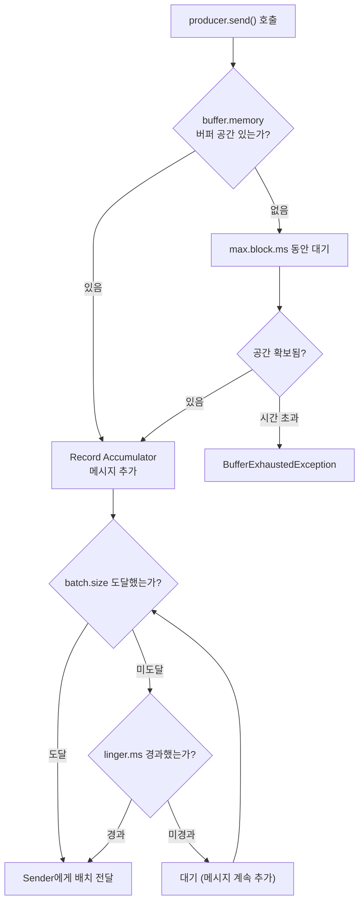
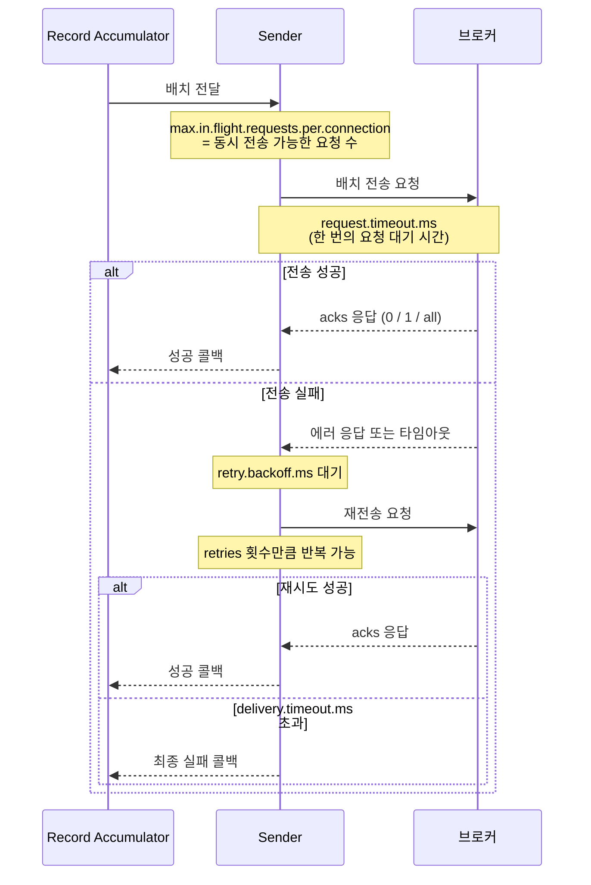
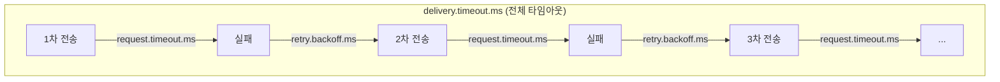

## Kafka 프로듀서

Kafka 프로듀서는 메시지를 생성하여 Kafka 클러스터의 특정 토픽에 게시하는 역할을 한다.
프로듀서는 메시지를 생성할 때, 메시지 키와 값을 지정할 수 있으며, 메시지 키를 해시처리하여 특정 파티션에 메시지를 저장할 수 있다. <br/>

> 참고로 메시지는 키와 값으로 구성되며, 키는 필수 항목이 아니다.

### Serializer

직렬화란 클라이언트의 요청 메시지를 서버가 이해할 수 있는 형태로 변환하는 과정이다.
Kafka 프로듀서를 이용하여 메시지를 게시할때 ***메시지의 키와 값을 Kafka가 이해할 수 있는 형태로 변환*** 하기 위해서 Serializer를 사용한다. <br/>

#### Serializer 설정

어떤 Serializer를 사용할지는 프로듀서 생성 시점에 설정을 통해서 지정할 수 있다.

- `key.serializer`: 메시지 키를 직렬화하는데 사용
- `value.serializer`: 메시지 값을 직렬화하는데 사용

```java
Properties prop = new Properties();
prop.

setProperty("bootstrap.servers","localhost:9092,localhost:9093,localhost:9094");
prop.

setProperty("key.serializer",StringSerializer .class.getName());
    prop.

setProperty("value.serializer",StringSerializer .class.getName());

KafkaProducer<String, String> producer = new KafkaProducer<>(prop);
```

Kafka는 다양한 Serializer를 제공할 수 있으며, 필요에 따라 커스텀 Serializer를 구현하여 사용할 수도 있다. <br/>

- `JsonSerializer`: JSON 형식으로 직렬화. 사람이 읽기 쉽지만, 필드명이 매번 포함되어 메시지 크기가 크고 스키마 호환성 검증이 없다. (보편적으로 많이 사용되는 직렬화 방식)
- `AvroSerializer`: 스키마 기반 바이너리 직렬화. Schema Registry와 함께 사용하여 프로듀서/컨슈머 간 스키마 호환성을 배포 전에 검증할 수 있다.
- `ProtobufSerializer`: Google Protocol Buffers 기반 바이너리 직렬화. Avro와 유사하지만 다양한 언어 지원이 강력하여, 여러 언어로 작성된 서비스 간 통신에 유리하다.
- `커스텀 Serializer`: `Serializer<T>` 인터페이스를 이용하여 압축이나 암호화 등 특정 요구사항에 맞는 직렬화 로직을 구현할 수 있다.

### Parititioner

Kafka는 하나의 토픽에 여러개의 파티션을 생성할 수 있다. 때문에 프로듀서는 ***어느 파티션에 메시지를 게시할지를 결정*** 해야한다.
Partitioner는 프로듀서가 메시지를 게시할 때, ***메시지가 어느 파티션에 저장될지를 결정하는 역할*** 을 한다. <br/>

```java
public class KafkaProducer<K, V> implements Producer<K, V> {

  private Future<RecordMetadata> doSend(ProducerRecord<K, V> record, Callback callback) {

    //....

    // 어느 파티션에 메시지를 게시할지 결정하는 로직
    int partition = partition(record, serializedKey, serializedValue, cluster);

    //....

    // RecordAccumulator에 메시지를 추가하여 전송 대기열에 저장
    RecordAccumulator.RecordAppendResult result = accumulator.append(record.topic(), partition, timestamp, serializedKey,
        serializedValue, headers, appendCallbacks, remainingWaitMs, abortOnNewBatch, nowMs, cluster);
    //....
  }
}
```

Partitioner는 메시지의 키가 있는 경우와 없는 경우에 따라서 메시지를 저장할 파티션을 결정하는 방식이 다르다.

- 메시지 키가 있는 경우: 메시지 키를 해시 처리하여 특정 파티션에 메시지를 저장한다. 이렇게 하면 동일한 키를 가진 메시지는 항상 같은 파티션에 저장된다.
    - `hash(key) % 파티션 수`
- 메시지 키가 없는 경우: 메시지 키가 없는 경우에는 라운드로빈 파티셔너, 스티키 파티셔너, 커스텀 파티셔너 등 다양한 방식으로 메시지를 저장할 파티션을 결정할 수 있다. <br/>
    - 라운드로빈 파티셔너: 메시지를 순차적으로 각 파티션에 분배하는 방식
    - 스티키 파티셔너: 메시지를 하나의 파티션에 먼저 저장한 이후 다른 파티션에 저장하는 방식 (default)
- 커스텀 파티셔너: 개발자가 직접 구현한 파티셔너로, 특정 비즈니스 로직에 따라 메시지를 저장할 파티션을 결정하는 방식

#### Partitioner 설정

어떤 Partitioner를 사용할지는 프로듀서 생성 시점에 설정을 통해서 지정할 수 있다.

- `partitioner.class`: 메시지를 저장할 파티션을 결정하는데 사용

```java
Properties prop = new Properties();
prop.

setProperty("bootstrap.servers","localhost:9092,localhost:9093,localhost:9094");
prop.

setProperty("partitioner.class",CustomPartitioner .class.getName());

KafkaProducer<String, String> producer = new KafkaProducer<>(prop);
```

### Record Accumulator

Record Accumulator는 프로듀서가 메시지를 게시할 때, 브로커에게 메시지를 전송하기 전에 ***메시지를 임시로 저장하는 버퍼 역할*** 을 한다. <br/>
이러한 처리가 필요한 이유는 메시지를 ***전송할때마다 네트워크 통신이 발생하는 비용을 줄이고, 메시지를 배치로 묶어서 전송하여 처리량을 높이기 위해서*** 이다. <br/>
뿐만 아니라 메시지를 배치로 묶어서 압축하여 전송할 수 있기 때문에 네트워크 대역폭을 효율적으로 사용할 수 있다. <br/>

> 애플리케이션 메모리 내에서 메시지를 임시로 저장하는 역할을 하기 때문에 애플리케이션 장애가 발생하면 Record Accumulator에 저장된 메시지는 손실될 수 있다.

#### Record Accumulator 설정

Record Accumulator의 설정은 크게 **메모리 관리**, **배치 전송 조건**, **압축** 으로 나눌 수 있다.

**메모리 관리**

- `buffer.memory`: Record Accumulator의 총 버퍼 크기이다. 모든 파티션의 배치를 합산한 전체 메모리 상한을 지정한다.
- `max.block.ms`: `buffer.memory`가 가득 찼을 때, 프로듀서가 공간이 확보될 때까지 대기하는 최대 시간이다.

**배치 전송 조건**

- `batch.size`: 파티션별 배치 하나의 크기이다. 배치가 이 크기에 도달하면 즉시 Sender에게 전달된다.
- `linger.ms`: 배치가 가득 차지 않더라도, 이 시간이 경과하면 Sender에게 전달된다. `batch.size`와 함께 처리량과 지연시간 사이의 트레이드오프를 조절한다.

**압축**

- `compression.type`: 배치를 압축하여 전송할 때 사용하는 알고리즘을 지정한다. `none`(기본), `gzip`, `snappy`, `lz4`, `zstd`를 지원한다.



이러한 설정들을 통해서 각 상황별로 메시지를 브로커에게 전송하는 시점을 제어할 수 있다. <br/>

- 처리량을 높이기 위해서 `batch.size`와 `linger.ms`를 높이게 되면 네트워크 통신비용을 줄일 수 있지만, 메시지가 브로커에게 전송되는 시점이 늦어질 수 있다.
    - 실시간 처리가 중요한 경우에는 `batch.size`와 `linger.ms`를 낮게 설정하는 것이 좋다.
- 지연시간을 줄이기 위해서 `batch.size`와 `linger.ms`를 낮게 설정하게 되면 메시지가 브로커에게 전송되는 시점이 빨라질 수 있지만, 네트워크 통신 비용이 증가할 수 있다.

### Sender

Sender는 Record Accumulator에 저장된 ***메시지를 브로커에게 전송하는 역할*** 을 한다.
별도의 스레드에서 실행되며, Record Accumulator에 저장된 메시지를 주기적으로 확인하여 브로커에게 전송한다. <br/>
브로커에게 메시지를 전송하기 때문에 `KafkaClient`를 이용하여 실제 네트워크 통신이 일어나는 영역이며, 네트워크 통신 과정을 관리하는 역할도 한다. <br/>

#### Sender 설정

Sender의 설정은 크게 **전송 신뢰성**, **재시도 & 타임아웃**, **순서 보장**, **트랜잭션** 으로 나눌 수 있다.

**전송 신뢰성**

- `acks`: 브로커가 메시지를 수신했다고 응답하는 수준을 지정한다.
    - `acks=0`: 응답을 기다리지 않는다. 가장 빠르지만 메시지 유실 가능성이 있다.
    - `acks=1`: 리더 브로커가 기록하면 성공으로 처리한다. 리더 장애 시 팔로워에 아직 복제되지 않은 메시지는 유실될 수 있다.
    - `acks=all`: 리더와 모든 ISR(In-Sync Replicas)이 기록해야 성공으로 처리한다. 가장 안전하지만 응답 지연이 가장 크다.
- `enable.idempotence`: 메시지 전송의 중복을 방지하는 설정이다. 활성화하면 브로커가 시퀀스 번호를 추적하여, 재시도로 인한 메시지 중복 저장을 방지한다.

**재시도 & 타임아웃**

- `retries`: 전송 실패 시 재시도 횟수이다. 기본값은 사실상 무한(2147483647)이며, 실제로는 `delivery.timeout.ms`에 의해 제한된다.
- `retry.backoff.ms`: 재시도 사이의 대기 시간이다.
- `request.timeout.ms`: 한 번의 전송 요청에 대한 브로커 응답 대기 시간이다.
- `delivery.timeout.ms`: send() 호출부터 최종 성공/실패까지의 전체 타임아웃이다. 재시도를 포함한 모든 시간을 제한한다.

**순서 보장**

- `max.in.flight.requests.per.connection`: 브로커 응답을 기다리지 않고 동시에 전송할 수 있는 요청 수이다. 값이 1이면 순서가 보장되지만 처리량이 감소한다. `enable.idempotence=true`이면 최대 5까지 순서를 보장한다.

**트랜잭션**

- `transactional.id`: 트랜잭션 프로듀서를 생성하기 위한 고유 ID이다. 여러 메시지를 하나의 원자적 단위로 묶어서 전송하며, 실패 시 전체 롤백이 가능하다.
- `transaction.timeout.ms`: 트랜잭션이 완료되기까지의 최대 대기 시간이다. 초과 시 롤백된다.





### Kafka 프로듀서 장애 시나리오

#### 시나리오 1: 브로커 전체 장애

```
증상: send() 후 delivery.timeout.ms(2분) 후에 TimeoutException
원인: 모든 브로커가 죽었거나 네트워크 단절
대응: buffer.memory가 가득 차면 send() 자체가 블로킹 → 앱 전체가 멈출 수 있음
→ max.block.ms 설정으로 블로킹 시간 제한 필요
```

#### 시나리오 2: 특정 파티션의 리더 변경 중

```
증상: 일시적으로 NOT_LEADER_OR_FOLLOWER 에러
원인: 리더 브로커 교체 중 (롤링 배포 등)
대응: retries가 기본값(매우 큼)이므로 자동 재시도 → 대부분 자동 복구
```

#### 시나리오 3: 메시지 크기 초과

```
증상: RecordTooLargeException
원인: 메시지 크기 > max.request.size (기본 1MB)
대응:
  - 큰 데이터는 외부 저장소(S3 등)에 넣고 참조만 Kafka로
  - 정말 필요하면 max.request.size와 브로커의 message.max.bytes 함께 조정
```

> [Kafka Confluent Docs > Producer](https://docs.confluent.io/platform/7.5/clients/producer.html)
