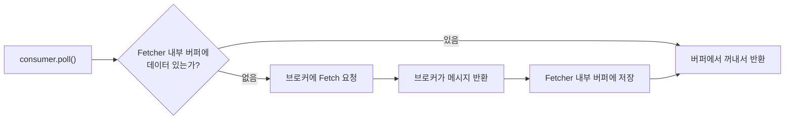
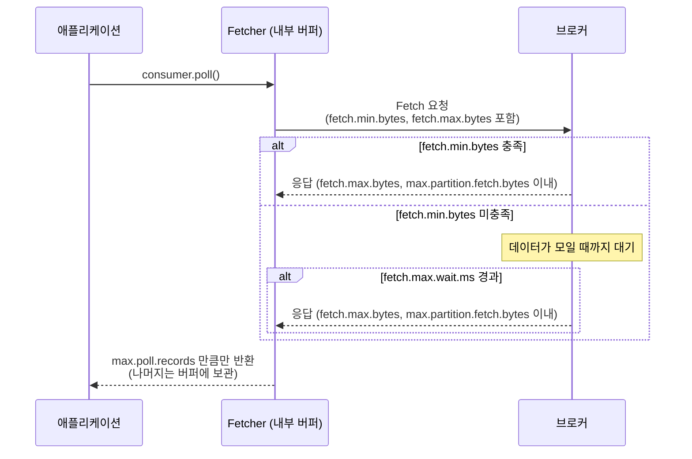
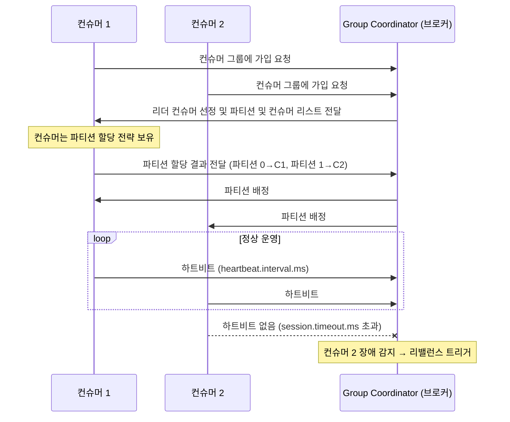

## Kafka 컨슈머

Kafka 컨슈머는 Kafka 클러스터에서 메시지를 읽어오는 역할을 한다. 컨슈머는 특정 토픽과 파티션에서 메시지를 읽어오며, 메시지의 오프셋을 관리하여 어디까지 메시지를 읽었는지를 추적한다. <br/>
또한 Polling 방식으로 메시지를 읽어오기 때문에 컨슈머가 메시지를 읽어오는 시점을 제어할 수 있다. <br/>

### Consumer Group

Kafka는 토픽 내에 파티션이라는 계층적 구조를 통해 메시지를 저장한다.
컨슈머 그룹은 이 ***파티션을 그룹 내 컨슈머들에게 분배하여 하나의 토픽에서 병렬로 메시지를 처리*** 할 수 있게 한다. <br/>
하나의 토픽에 여러 개의 컨슈머 그룹이 존재할 수 있으며, ***서로 다른 컨슈머 그룹은 같은 토픽에서 독립적으로 메시지를 읽어온다.*** <br/>

컨슈머 그룹의 핵심은 두 가지이다.
- **같은 그룹 내 컨슈머**: 파티션을 **나누어** 읽는다 (병렬 처리)
- **다른 그룹**: 같은 메시지를 **독립적으로** 읽는다

```
토픽 (파티션 3개)
├── 파티션 0 ──→ 컨슈머 그룹 A - 컨슈머 1
├── 파티션 1 ──→ 컨슈머 그룹 A - 컨슈머 2
├── 파티션 2 ──→ 컨슈머 그룹 A - 컨슈머 3
│
├── 파티션 0 ──→ 컨슈머 그룹 B - 컨슈머 1  (같은 메시지를 독립적으로 읽음)
├── 파티션 1 ──→ 컨슈머 그룹 B - 컨슈머 2
└── 파티션 2 ──→ 컨슈머 그룹 B - 컨슈머 1  (컨슈머가 2개면 하나가 2개 파티션 담당)
```

#### Consumer Group과 Partition의 관계
일반적으로 Consumer Group을 구성할 때는 컨슈머 수와 파티션 수를 동일하게 맞추는 것이 좋다. 그래야지 컨슈머가 각자 하나의 파티션을 담당하여 메시지를 병렬로 처리할 수 있기 때문이다. <br/>
아닌 경우에는 아래와 같은 상황이 발생할 수 있다.
- 컨슈머 수가 파티션 수보다 적은 경우: 일부 컨슈머가 여러 개의 파티션을 담당하게 되어 병목현상이 발생할 수 있다. (Consumer Lag 증가)
- 컨슈머 수가 파티션 수보다 많은 경우: 일부 컨슈머가 유휴 상태가 되어 리소스 낭비가 발생할 수 있다.


### Fetcher

Fetcher는 브로커에서 **메시지를 가져오는 역할**을 한다. 프로듀서의 Sender가 브로커에 보내는 역할이라면, Fetcher는 그 반대이다. <br/>
프로듀서의 Sender가 메시지를 브로커에 보내는 과정에서 Record Accumulator가 배치로 모아서 보내서 커넥션을 효율적으로 사용하는 것처럼, Fetcher도 `consumer.poll()`을 호출할 때마다 브로커에 요청하는 것이 아니라, Fetcher가 **미리 메시지를 가져와 내부 버퍼에 저장**해두고 poll() 호출 시 버퍼에서 꺼내준다. <br/> 



#### Fetcher 설정

Fetcher의 설정은 크게 **네트워크**와 **버퍼**로 나눌 수 있다.

**네트워크**

- `fetch.min.bytes`: 브로커가 최소 이만큼 데이터가 모일 때까지 응답을 지연한다. 컨슈머가 설정하지만 실제 대기는 브로커 측에서 이루어진다. (기본값: 1)
- `fetch.max.wait.ms`: `fetch.min.bytes`를 만족하지 못해도 이 시간이 지나면 응답한다. (기본값: 500ms)
- `fetch.max.bytes`: 한 번의 Fetch 요청으로 가져올 수 있는 최대 크기이다. (기본값: 50MB)
- `max.partition.fetch.bytes`: 파티션당 가져올 수 있는 최대 크기이다. (기본값: 1MB)

> 프로듀서의 Record Accumulator와 대칭되는 구조이며, Fetcher도 **배치로 모아서 가져오는 방식**을 사용한다. <br/>
> - 프로듀서: `batch.size`(모아서 보내기) / `linger.ms`(최대 대기)
> - 컨슈머: `fetch.min.bytes`(모아서 가져오기) / `fetch.max.wait.ms`(최대 대기)

**버퍼**

- `max.poll.records`: Fetcher 내부 버퍼에서 poll() 호출 시 한 번에 반환할 최대 레코드 수이다. 네트워크와 무관하며, 이미 가져온 데이터에서 꺼내는 양을 제한한다. (기본값: 500)




### Deserializer
역직렬화란 서버에서 응답한 데이터를 클라이언트가 이해할 수 있는 형태로 변환하는 과정이다. Kafka 컨슈머를 이용하여 메시지를 읽어올때 ***메시지의 키와 값을 클라이언트가 이해할 수 있는 형태로 변환하기 위하여 Deserializer*** 를 사용한다. <br/>

```
프로듀서: 객체 → Serializer → byte[] → 브로커
컨슈머: 브로커 → byte[] → Deserializer → 객체
```

#### Deserializer 설정
- `key.deserializer`: 메시지 키를 역직렬화할 때 사용
- `value.deserializer`: 메시지 값을 역직렬화할 때 사용 
<br/>

Kafka는 다양한 Deserializer를 제공하며, 필요에 따라 커스텀 Deserializer를 구현하여 사용할 수도 있다.


### Offset Commit

Offset Commit은 컨슈머가 **어디까지 메시지를 읽었는지를 기록하는 과정**이다. 커밋된 오프셋은 브로커의 `__consumer_offsets`라는 내부 토픽에 저장된다. <br/>
이 기록이 있기 때문에 컨슈머측에서 장애가 발생하거나 재시작하더라도, 커밋된 오프셋부터 다시 읽어올 수 있다. <br/>

```
파티션 0: [msg0] [msg1] [msg2] [msg3] [msg4] [msg5] [msg6] ...
                                 ↑                    ↑
                          committed offset      현재 읽는 위치
                          (여기까지 처리 완료)
```

#### Consumer Offset
`__consumer_offsets`은 Kafka 클러스터 내의 특별한 토픽으로, 컨슈머 그룹 및 파티션별 오프셋 커밋 정보를 저장하는 역할을 한다. <br/>
같은 파티션을 여러 컨슈머 그룹이 독립적으로 읽을 수 있기 때문에, 읽은 위치도 그룹마다 따로 기록되어야 한다. <br/>
```
__consumer_offsets 토픽에 저장되는 데이터:

Key: (그룹ID, 토픽명, 파티션번호)    →    Value: (커밋된 오프셋, 타임스탬프)

예시:
(group-A, my-topic, 0) → offset=150    "그룹 A는 파티션 0을 150까지 읽었다"
(group-A, my-topic, 1) → offset=230    "그룹 A는 파티션 1을 230까지 읽었다"
(group-B, my-topic, 0) → offset=80     "그룹 B는 파티션 0을 80까지 읽었다"
```

`__consumer_offsets` 도 토픽이기 때문에, 토픽 설정이 적용되며 브로커 설정(server.properties)에서 다음과 같이 설정할 수 있다.
- `offsets.topic.num.partitions`: `__consumer_offsets` 토픽의 파티션 수 
- `offsets.topic.replication.factor`: `__consumer_offsets` 토픽의 복제 팩터

#### Offset Commit 설정

- `enable.auto.commit`: 자동 커밋 활성화 여부 (기본값: true)
- `auto.commit.interval.ms`: 자동 커밋 주기 (기본값: 5000ms)
- `auto.offset.reset`: 컨슈머 그룹이 처음 시작할때나 커밋된 오프셋이 유효하지 않을때 읽기 시작할 위치 (기본값: latest)
    - `latest`: 가장 최신 오프셋부터 읽는다. (기본값)
    - `earliest`: 가장 처음 오프셋부터 읽는다.
    - `none`: 커밋된 오프셋이 없으면 예외를 발생시킨다.

> 커밋된 오프셋이 유효하지 않다는 의미는, 메시지가 삭제되어 커밋된 오프셋이 더이상 존재하지 않는다는 의미이다. Kafka는 토픽의 메시지를 일정 기간이 지나면 삭제하는데, 이때 커밋된 오프셋이 삭제된 메시지보다 뒤에 있으면 유효하지 않다고 판단한다.

#### 오프셋 커밋 방식

**자동 커밋 (Auto Commit)**

`enable.auto.commit=true` 로 설정하면, `auto.commit.interval.ms` 간격으로 poll() 시점에 자동으로 오프셋을 커밋한다. <br/>
메시지 처리 완료 시점이 아니라 poll() 시점에 커밋을 하기 때문에, 메시지 처리 완료 전에 장애가 발생하면 커밋된 오프셋 이후의 메시지가 유실될 수 있다. <br/>
또한 메시지 처리에 대한 에러 발생시에도 커밋이 되기 때문에, 해당 메시지 재처리에 대한 제어가 어렵다. <br/>

```
poll() → offset 100~110 수신 → 자동 커밋 (committed = 110)
                                → 처리 중 장애 발생!
                                → 재시작 시 111부터 읽음
                                → 100~110 중 미처리된 메시지 유실
```

**수동 커밋 (Manual Commit)**

`enable.auto.commit=false`로 설정하고, 애플리케이션에서 명시적으로 커밋한다. 메시지 처리가 완료된 후 커밋하므로 유실을 방지할 수 있다.

```java
ConsumerRecords<String, String> records = consumer.poll(Duration.ofMillis(1000));
for (ConsumerRecord<String, String> record : records) {
    // 메시지 처리
    processMessage(record);
}
// 처리 완료 후 커밋
consumer.commitSync();  // 동기 커밋 (커밋 성공까지 블로킹)
// consumer.commitAsync();  // 비동기 커밋 (블로킹 없음, 실패 시 콜백)
```

### Rebalance

Rebalance는 컨슈머 그룹 내의 컨슈머들이 담당하는 **파티션을 재분배하는 과정**이다. <br/>
파티션과 컨슈머는 유동적으로 변경될 수 있기 때문에, 변경 사항에 따라 파티션과 컨슈머를 다시 배정하는 과정이 필요하다.<br/>

Rebalance가 발생하는 상황은 다음과 같다.
- 새로운 컨슈머 그룹이 생성될 때
- 기존 컨슈머 그룹에서 컨슈머가 추가되거나 제거될 때
- 토픽의 파티션 수가 변경될 때

```
[Rebalance 전]                       [Rebalance 후 - 컨슈머 3 장애]
파티션 0 → 컨슈머 1                     파티션 0 → 컨슈머 1
파티션 1 → 컨슈머 2                     파티션 1 → 컨슈머 2
파티션 2 → 컨슈머 3                     파티션 2 → 컨슈머 1 (재분배)
```

#### Rebalance Protocol (Reblance 전략)

**Eager Rebalance (Kafka 2.4 이전)**

리밸런스가 발생하면 **모든 파티션을 회수한 뒤 전부 재배정**한다. 변경이 필요 없는 파티션까지 회수되므로 전체 컨슈머가 멈춘다.

```
[Before]                   [Revoke 전부]         [Reassign]
파티션 0 → 컨슈머 1       파티션 0 → (없음)     파티션 0 → 컨슈머 1
파티션 1 → 컨슈머 2       파티션 1 → (없음)     파티션 1 → 컨슈머 1
파티션 2 → 컨슈머 3(장애)  파티션 2 → (없음)     파티션 2 → 컨슈머 2
                           ↑ 전부 멈춤!
```

Eager Rebalance 전략은 리밸런스가 발생할 때마다 전체 컨슈머가 멈추기 때문에, 리밸런스 소요 시간이 길어질 수 있다. 특히 컨슈머 수가 많거나 파티션 수가 많을 때 리밸런스 소요 시간이 증가하여 서비스 가용성에 영향을 줄 수 있다.


**Cooperative Rebalance (Kafka 2.4+)**

**변경이 필요한 파티션만 재배정**한다. 나머지 컨슈머는 멈추지 않고 계속 메시지를 읽을 수 있다.

```
[Before]                   [Revoke 일부]         [Reassign]
파티션 0 → 컨슈머 1       파티션 0 → 컨슈머 1   파티션 0 → 컨슈머 1 (유지)
파티션 1 → 컨슈머 2       파티션 1 → 컨슈머 2   파티션 1 → 컨슈머 2 (유지)
파티션 2 → 컨슈머 3(장애)  파티션 2 → (없음)     파티션 2 → 컨슈머 1 (재배정)
                           ↑ 파티션 2만 멈춤
```

Cooperative Rebalance 전략은 리밸런스가 발생할 때 변경이 필요한 파티션만 멈추기 때문에, 리밸런스 소요 시간이 짧아지고 서비스 가용성에 미치는 영향이 줄어든다. 특히 컨슈머 수가 많거나 파티션 수가 많을 때 효과적이다. <br/>

> Cooperative Rebalance를 사용하려면 `partition.assignment.strategy`를 `CooperativeStickyAssignor`로 설정하면 된다.


#### Rebalance의 문제점

**1. 처리 중단 (Stop-the-World)**

Eager Rebalance 전략에서는 리밸런스가 진행되는 동안 **모든 컨슈머가 메시지 읽기를 중단**한다. 파티션 재배정 중에 여러 컨슈머가 같은 파티션을 동시에 읽는 것을 방지하기 위해서이다. 리밸런스 소요 시간은 컨슈머 수, 파티션 수에 따라 수 초 ~ 수십 초까지 걸릴 수 있다.

**2. 메시지 중복 처리**

```
1. 컨슈머 1이 파티션 0에서 offset 100~110을 읽어서 처리 중
2. 아직 오프셋 커밋 전 (committed offset = 100)
3. 리밸런스 발생 -> 파티션 0이 컨슈머 2에게 재배정
4. 컨슈머 2가 committed offset(100)부터 다시 읽기 시작
5. offset 100~110이 다시 처리됨 -> 중복 처리 발생!!
```

이를 방지하기 위해서는 메시지 처리시 최대한 멱등성을 보장하도록 구현하고, 수동 커밋을 사용하여 메시지 처리 완료 후에 오프셋을 커밋하는 방식으로 구현해야 한다. <br/>
예를 들어 Redis나 데이터베이스에 메시지 ID를 저장하여 이미 처리된 메시지를 체크하는 방식으로 멱등성을 보장할 수 있다.


**3. 리밸런스 폭풍 (Rebalance Storm)**

```
컨슈머 장애 -> 리밸런싱 -> 메시지 처리 지연 -> 컨슈머 장애 -> 리밸런싱 -> 메시지 처리 지연 -> 컨슈머 장애 -> ...
```

리밸런스가 발생하면 메시지 처리 지연이 발생할 수 있는데, 이로 인해 다른 컨슈머들도 장애가 발생하여 리밸런스가 연쇄적으로 발생하는 현상이다. <br/>
이를 방지하기 위해서는 리밸런스 트리거 조건을 적절히 설정하여, 일시적인 장애나 처리 지연으로 인한 리밸런스 발생을 최소화해야 한다. 예를 들어, `session.timeout.ms`와 `max.poll.interval.ms` 값을 조정하여 컨슈머 장애 감지와 처리 지연 감지의 민감도를 조절할 수 있다.


### Coordinator
Kafka의 토픽은 여러 개의 파티션으로 나뉘어져 있고, 컨슈머 그룹은 이 파티션들을 컨슈머들에게 분배하여 메시지를 읽는다. 때문에 ***컨슈머 그룹과 그룹내에 속한 컨슈머들을 중앙에서 관리하는 주체가 필요*** 한데 그 역할을 하는 것이 Coordinator이다. <br/>
Coordinator는 브로커 측의 **Group Coordinator**와 컨슈머 측의 **Consumer Coordinator**로 나뉜다.
- **Group Coordinator**: 브로커 중 하나가 담당하며, 컨슈머 그룹의 관리, 오프셋 커밋 저장(`__consumer_offsets` 토픽), 리밸런스 트리거를 수행한다.
- **Consumer Coordinator**: 각 컨슈머 내부에 존재하며, Group Coordinator와 통신하여 컨슈머가 정상 운영되고 있는지 하트비트를 보낸다.



#### Coordinator 설정

Coordinator의 설정은 크게 **장애 감지**와 **처리 지연 감지**로 나눌 수 있다.

**장애 감지** — 컨슈머가 죽었는지 판단

- `heartbeat.interval.ms`: 컨슈머가 Group Coordinator에게 하트비트를 보내는 주기이다. (기본값: 3초)
- `session.timeout.ms`: 이 시간 동안 하트비트가 없으면 컨슈머가 죽은 것으로 판단하여 리밸런스를 트리거한다. (기본값: 45초)

**처리 지연 감지** — 컨슈머가 느린지 판단

- `max.poll.interval.ms`: poll() 호출 간격이 이 시간을 넘으면 메시지 처리가 너무 느린 것으로 판단하여 리밸런스를 트리거한다. (기본값: 5분)

> `session.timeout.ms`는 **네트워크/프로세스 장애** 감지, `max.poll.interval.ms`는 **메시지 처리 지연** 감지 — 목적이 다르다.

> [Kafka Confluent Docs > Consumer](https://docs.confluent.io/platform/7.5/clients/consumer.html)