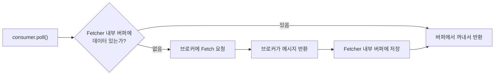
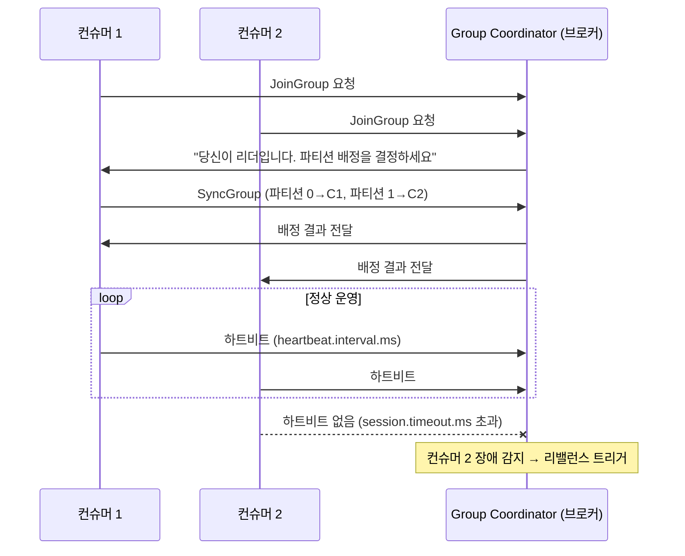

## Kafka 컨슈머

Kafka 컨슈머는 Kafka 클러스터에서 메시지를 읽어오는 역할을 한다. 컨슈머는 특정 토픽과 파티션에서 메시지를 읽어오며, 메시지의 오프셋을 관리하여 어디까지 메시지를 읽었는지를 추적한다. <br/>
또한 Polling 방식으로 메시지를 읽어오기 때문에 컨슈머가 메시지를 읽어오는 시점을 제어할 수 있다. <br/>

### Consumer Group

Kafka는 토픽 내에 파티션이라는 계층적 구조를 통해 메시지를 저장한다.
컨슈머 그룹은 이 ***파티션을 그룹 내 컨슈머들에게 분배하여 하나의 토픽에서 병렬로 메시지를 처리*** 할 수 있게 한다. <br/>
하나의 토픽에 여러 개의 컨슈머 그룹이 존재할 수 있으며, ***서로 다른 컨슈머 그룹은 같은 토픽에서 독립적으로 메시지를 읽어온다.*** <br/>

컨슈머 그룹의 핵심은 두 가지이다.
- **같은 그룹 내 컨슈머**: 파티션을 **나누어** 읽는다 (병렬 처리)
- **다른 그룹**: 같은 메시지를 **독립적으로** 읽는다

```
토픽 (파티션 3개)
├── 파티션 0 ──→ 컨슈머 그룹 A - 컨슈머 1
├── 파티션 1 ──→ 컨슈머 그룹 A - 컨슈머 2
├── 파티션 2 ──→ 컨슈머 그룹 A - 컨슈머 3
│
├── 파티션 0 ──→ 컨슈머 그룹 B - 컨슈머 1  (같은 메시지를 독립적으로 읽음)
├── 파티션 1 ──→ 컨슈머 그룹 B - 컨슈머 2
└── 파티션 2 ──→ 컨슈머 그룹 B - 컨슈머 1  (컨슈머가 2개면 하나가 2개 파티션 담당)
```

#### Consumer Group과 Partition의 관계
일반적으로 Consumer Group을 구성할 때는 컨슈머 수와 파티션 수를 동일하게 맞추는 것이 좋다. 그래야지 컨슈머가 각자 하나의 파티션을 담당하여 메시지를 병렬로 처리할 수 있기 때문이다. <br/>
아닌 경우에는 아래와 같은 상황이 발생할 수 있다.
- 컨슈머 수가 파티션 수보다 적은 경우: 일부 컨슈머가 여러 개의 파티션을 담당하게 되어 병목현상이 발생할 수 있다. (Consumer Lag 증가)
- 컨슈머 수가 파티션 수보다 많은 경우: 일부 컨슈머가 유휴 상태가 되어 리소스 낭비가 발생할 수 있다.


### Fetcher

Fetcher는 브로커에서 **메시지를 가져오는 역할**을 한다. 프로듀서의 Sender가 브로커에 보내는 역할이라면, Fetcher는 그 반대이다. <br/>
`consumer.poll()`을 호출할 때마다 브로커에 요청하는 것이 아니라, Fetcher가 **미리 메시지를 가져와 내부 버퍼에 저장**해두고 poll() 호출 시 버퍼에서 꺼내준다. <br/>



#### Fetcher 설정

Fetcher의 설정은 크게 **가져오기 조건**과 **반환 제한**으로 나눌 수 있다.

**가져오기 조건** — 브로커에서 얼마나, 언제 가져올 것인가
- `fetch.min.bytes`: 브로커가 최소 이만큼 데이터가 모일 때까지 응답을 지연한다. (기본값: 1)
- `fetch.max.wait.ms`: `fetch.min.bytes`를 만족하지 못해도 이 시간이 지나면 응답한다. (기본값: 500ms)
- `fetch.max.bytes`: 한 번의 Fetch 요청으로 가져올 수 있는 최대 크기이다. (기본값: 50MB)
- `max.partition.fetch.bytes`: 파티션당 가져올 수 있는 최대 크기이다. (기본값: 1MB)

**반환 제한** — poll() 한 번에 얼마나 반환할 것인가
- `max.poll.records`: poll() 한 번에 반환하는 최대 레코드 수이다. (기본값: 500)

> 프로듀서의 Record Accumulator와 대칭되는 구조이다. <br/>
> 프로듀서: `batch.size`(모아서 보내기) / `linger.ms`(최대 대기) <br/>
> 컨슈머: `fetch.min.bytes`(모아서 가져오기) / `fetch.max.wait.ms`(최대 대기)

### Deserializer

Deserializer는 브로커에서 가져온 **바이트 배열을 객체로 변환하는 역할**을 한다. 프로듀서의 Serializer와 반대 방향이다. <br/>

```
프로듀서: 객체 → Serializer → byte[] → 브로커
컨슈머: 브로커 → byte[] → Deserializer → 객체
```

프로듀서에서 사용한 Serializer와 **반드시 대응되는 Deserializer를 사용**해야 한다. 그렇지 않으면 역직렬화 시 `SerializationException`이 발생한다.

| 프로듀서 (Serializer) | 컨슈머 (Deserializer) |
|---|---|
| `StringSerializer` | `StringDeserializer` |
| `JsonSerializer` | `JsonDeserializer` |
| `KafkaAvroSerializer` | `KafkaAvroDeserializer` |
| `KafkaProtobufSerializer` | `KafkaProtobufDeserializer` |

### Offset Commit

Offset Commit은 컨슈머가 **어디까지 메시지를 읽었는지를 기록하는 과정**이다. 커밋된 오프셋은 브로커의 `__consumer_offsets`라는 내부 토픽에 저장된다. <br/>
이 기록이 있기 때문에 컨슈머가 재시작하거나 리밸런스가 발생해도, 마지막으로 커밋된 오프셋부터 이어서 읽을 수 있다. <br/>

```
파티션 0: [msg0] [msg1] [msg2] [msg3] [msg4] [msg5] [msg6] ...
                                 ↑                    ↑
                          committed offset      현재 읽는 위치
                          (여기까지 처리 완료)
```

#### 오프셋 커밋 방식

**자동 커밋 (Auto Commit)**

`enable.auto.commit=true` (기본값)로 설정하면, `auto.commit.interval.ms` (기본값: 5초) 간격으로 poll() 시점에 자동으로 오프셋을 커밋한다. <br/>
간편하지만 메시지를 읽은 후 **처리가 완료되기 전에 커밋될 수 있어서**, 컨슈머 장애 시 메시지 유실이 발생할 수 있다.

```
poll() → offset 100~110 수신 → 자동 커밋 (committed = 110)
                                → 처리 중 장애 발생!
                                → 재시작 시 111부터 읽음
                                → 100~110 중 미처리된 메시지 유실
```

**수동 커밋 (Manual Commit)**

`enable.auto.commit=false`로 설정하고, 애플리케이션에서 명시적으로 커밋한다. 메시지 처리가 완료된 후 커밋하므로 유실을 방지할 수 있다.

```java
ConsumerRecords<String, String> records = consumer.poll(Duration.ofMillis(1000));
for (ConsumerRecord<String, String> record : records) {
    // 메시지 처리
    processMessage(record);
}
// 처리 완료 후 커밋
consumer.commitSync();  // 동기 커밋 (커밋 성공까지 블로킹)
// consumer.commitAsync();  // 비동기 커밋 (블로킹 없음, 실패 시 콜백)
```

#### 커밋 방식별 트레이드오프

| | 자동 커밋 | 수동 동기 커밋 | 수동 비동기 커밋 |
|---|---|---|---|
| 설정 | `enable.auto.commit=true` | `commitSync()` | `commitAsync()` |
| 메시지 유실 | 가능 | 방지 | 방지 |
| 메시지 중복 | 가능 | 가능 (처리 후 커밋 전 장애) | 가능 |
| 처리량 | 높음 | 낮음 (블로킹) | 높음 |
| 구현 복잡도 | 간단 | 보통 | 높음 (실패 처리 필요) |

> 어떤 커밋 방식을 사용하더라도 **"처리 완료 ~ 커밋 사이"에 장애가 발생하면 중복 처리가 발생**할 수 있다. 이는 Kafka가 기본적으로 **at-least-once**(최소 1회 전달) 시맨틱을 보장하기 때문이다.

### Rebalance

Rebalance는 컨슈머 그룹 내의 컨슈머들이 담당하는 **파티션이 재분배되는 과정**이다. 다음과 같은 상황에서 발생한다.
- 새로운 컨슈머가 그룹에 합류할 때
- 기존 컨슈머가 그룹을 떠날 때 (정상 종료 또는 장애)
- 토픽의 파티션 수가 변경될 때

```
[Rebalance 전]                          [Rebalance 후 - 컨슈머 3 장애]
파티션 0 → 컨슈머 1                     파티션 0 → 컨슈머 1
파티션 1 → 컨슈머 2                     파티션 1 → 컨슈머 2
파티션 2 → 컨슈머 3                     파티션 2 → 컨슈머 1 (재분배)
```

> ⚠️ Rebalance가 진행되는 동안 해당 컨슈머 그룹의 **모든 컨슈머가 메시지 읽기를 중단**한다. 따라서 리밸런스가 자주 발생하면 처리량이 크게 떨어질 수 있다.

### Coordinator

Rebalance가 발생하면 "파티션을 누가 읽을지"를 다시 정해야 한다. 이를 컨슈머들끼리 알아서 하면 충돌이 생길 수 있기 때문에 **중앙에서 관리하는 주체**가 필요한데, 그 역할을 하는 것이 Coordinator이다. <br/>

Coordinator는 브로커 측의 **Group Coordinator**와 컨슈머 측의 **Consumer Coordinator**로 나뉜다.
- **Group Coordinator**: 브로커 중 하나가 담당하며, 컨슈머 그룹의 멤버십 관리, 오프셋 커밋 저장(`__consumer_offsets` 토픽), 리밸런스 트리거를 수행한다.
- **Consumer Coordinator**: 각 컨슈머 내부에 존재하며, Group Coordinator와 통신하고 하트비트를 전송한다.



#### Coordinator 관련 설정
- `heartbeat.interval.ms`: 컨슈머가 Group Coordinator에게 하트비트를 보내는 주기이다. (기본값: 3초)
- `session.timeout.ms`: 이 시간 동안 하트비트가 없으면 컨슈머가 죽은 것으로 판단하여 리밸런스를 트리거한다. (기본값: 45초)
- `max.poll.interval.ms`: poll() 호출 간격이 이 시간을 넘으면 메시지 처리가 너무 느린 것으로 판단하여 리밸런스를 트리거한다. (기본값: 5분)

> `session.timeout.ms`는 **네트워크/프로세스 장애** 감지, `max.poll.interval.ms`는 **메시지 처리 지연** 감지 — 목적이 다르다.

> [Kafka Confluent Docs > Consumer](https://docs.confluent.io/platform/7.5/clients/consumer.html)