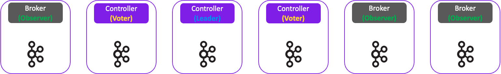

## Zookeeper

Kafka는 기본적으로 여러 브로커들로 구성된 클러스터로 운영되며, 클러스터링의 목적은 고가용성과 확장성을 제공하는데 있다. <br/>

그런데 브로커가 여러 대면 자연스럽게 이런 질문이 생긴다

- 토픽내에 파티션마다 리더/팔로워가 있는데, 누가 이 역할을 정해주지?
- 브로커 1대가 갑자기 죽으면, 나머지 브로커들은 어떻게 알고 리더를 다시 정하지?
- 브로커에 장애가 발생하면, 나머지 브로커들은 이를 어떻게 감지하지?
- 브로커가 늘어나면 메타데이터도 늘어나는데, 이걸 어떻게 관리하지?

ZooKeeper는 이런 ***"클러스터 관리" 문제를 해결하기 위한 분산 코디네이션 서비스*** 다. Kafka는 Zookeeper를 이용해서 클러스터의 메타데이터 (브로커 정보, 토픽/파티션 정보, 리더/팔로워 정보 등)를 저장하고, 브로커 간의 상태를 감시하며, 장애 발생 시 리더
선출과 같은 작업을 수행한다.

### 브로커 등록 및 관리

Zookeeper는 Kafka 브로커들이 클러스터에 등록할 때 사용된다. 각 브로커는 시작 시 Zookeeper에 자신의 정보를 등록하고, Zookeeper는 이 정보를 바탕으로 클러스터의 상태를 관리한다.

#### 브로커 등록

브로커 시작 전에 `server.properties` 파일에서 `broker.id`와 `zookeeper.connect` 설정을 지정한다. 이렇게 하면 브로커가 시작될 때 Zookeeper에 연결하여 브로커의 정보를 Zookeeper에 임시 노드(Ephemeral Node)로 등록한다.
이 임시 노드는 브로커가 살아있는 동안 유지되며, 브로커가 죽으면 자동으로 삭제된다.

```
kafka-1 ──── "broker.id=1" ────→ ZooKeeper
                                    │
                                    ▼
                            /brokers/ids/1 (임시 노드 생성)
                            /brokers/ids/2
                            /brokers/ids/3
```

```sh
zookeeper-shell localhost:2181
## 등록된 브로커들 정보 보기
ls /brokers/ids

## 특정 브로커 정보 보기
get /brokers/ids/1
```

- `zookeeper.connection.timeout.ms`: 브로커가 Zookeeper에 연결할 때의 타임아웃 시간 (기본값: 6초)

#### 브로커 관리

Zookeeper는 브로커의 상태를 감시하는 역할도 한다. 브로커가 Zookeeper에게 주기적으로 heartbeat를 보내며, Zookeeper는 이 heartbeat를 통해 브로커가 살아있는지 확인한다. <br/>
만약 브로커가 죽으면, Zookeeper는 해당 브로커의 임시 노드를 삭제하고, 클러스터의 다른 브로커들에게 이 사실을 알린다.

- `zookeeper.session.timeout.ms`: 브로커가 Zookeeper와의 세션이 끊겼다고 판단하는 시간 (기본값: 18초)
    - 너무 짧은경우: GC나 네트워크 지연으로 인해 브로커가 일시적으로 응답하지 못할 때, Zookeeper가 브로커를 죽었다고 판단할 수 있음
    - 너무 긴경우: 브로커가 실제로 죽었을 때, Zookeeper가 이를 감지하는 데 시간이 오래 걸릴 수 있음

### 컨트롤러 선출

#### 컨트롤러란?

컨트롤러란 Kafka 브로커 중에서 1대가 추가로 맡는 "관리자" 역할이다. 별도의 서버가 아니라 브로커 중 하나가 겸임한다.

- 토픽/파티션의 리더/팔로워 배정
- 브로커 장애 시 리더 재선출
- 메타데이터 변경 사항을 다른 브로커에게 전파

Zookeeper는 모든 브로커와 연결되어 있지만, 메타데이터를 변경하고 관리하는 역할은 컨트롤러가 담당한다. 컨트롤러가 결정한 내용을 다른 브로커에게 전파하는 구조로 되어 있다.
> 만약 컨트롤러 없이 Zookeeper가 모든 브로커의 상태 감시, 리더 선출 등을 직접 수행한다면, Zookeeper에 과부하가 걸릴 수 있다.

```sh
zookeeper-shell localhost:2181
## 현재 컨트롤러 정보 보기
get /controller
```

#### 컨트롤러 선출 과정

클러스터가 처음 시작될 때, 각 브로커는 Zookeeper의 `/controller` 경로에 임시 노드를 만들려고 시도한다. **가장 먼저 임시 노드를 만든 브로커가 컨트롤러**가 되고, 나머지 브로커는 이 경로에 Watch를 등록하여 컨트롤러의 상태를 감시한다.

```
broker-1 -> /controller 임시 노드 생성 시도 -> 성공 -> 컨트롤러
broker-2 -> /controller 임시 노드 생성 시도 -> 이미 있음, 실패 -> Watch 등록
broker-3 -> /controller 임시 노드 생성 시도 -> 이미 있음, 실패 -> Watch 등록
```

#### 컨트롤러 재선출

컨트롤러가 죽으면 `/controller` 임시 노드가 자동으로 삭제된다. Watch를 등록한 나머지 브로커들이 이 변화를 감지하고, 다시 선착순으로 새 컨트롤러를 선출한다.

```
broker-1(컨트롤러) 죽음 -> /controller 임시 노드 삭제
broker-2: Watch 알림 수신 -> /controller 생성 시도 -> 성공 -> 새 컨트롤러
broker-3: Watch 알림 수신 -> /controller 생성 시도 -> 늦음, 실패 -> Watch 재등록
```

### 메타데이터 저장

Zookeeper는 Kafka 클러스터의 메타데이터를 **영구적으로 저장하는 저장소** 역할을 한다. 여기서 "저장한다"는 것은 단순히 정보를 들고 있는 것이 아니라, **컨트롤러나 브로커가 죽더라도 사라지지 않는 원본(Source of Truth)을 관리한다**는 뜻이다.

#### 왜 영구 저장소가 필요한가?

컨트롤러는 메타데이터 변경 사항을 결정하고 다른 브로커에게 전파하는 역할을 한다. 그런데 만약 컨트롤러가 메모리에만 정보를 들고 있다면, 컨트롤러가 죽는 순간 모든 결정이 사라지게 된다.

```
컨트롤러(broker-1)가 메모리에만 메타데이터를 가지고 있다면:
  - "test-topic partition-0 리더 = broker-2"
  - "test-topic partition-1 리더 = broker-3"
  
broker-1 죽음 → 메모리 싹 날아감 → 새 컨트롤러 선출
새 컨트롤러(broker-2): "지금 파티션 리더가 누구였지? 몰라..."
```

그래서 Kafka는 모든 메타데이터 변경을 **먼저 Zookeeper에 기록**한다. 컨트롤러가 죽어도 새 컨트롤러가 Zookeeper에서 읽어서 상태를 복원할 수 있고, 브로커가 재시작해도 최신 정보를 받아올 수 있다.

```
1. 컨트롤러가 결정 (예: "partition-0 리더 = broker-2")
2. Zookeeper에 기록 (영구 저장) ← 원본 저장
3. 다른 브로커들에게 전파 (캐시 업데이트)
```

정리하면 각 주체의 역할은 다음과 같다.

- **Zookeeper**: 영구 저장 (Source of Truth)
- **컨트롤러 / 브로커 메모리**: 휘발성 캐시 (죽으면 사라짐, Zookeeper에서 복원 가능)

#### Zookeeper에 저장되는 메타데이터

```
/
├── /brokers
│   ├── /ids                    # 살아있는 브로커 목록 (임시 노드)
│   │   ├── /1
│   │   ├── /2
│   │   └── /3
│   └── /topics                 # 토픽/파티션 정보
│       └── /test-topic
│           └── /partitions
│               ├── /0/state    # 파티션 0의 리더/팔로워 정보
│               ├── /1/state
│               └── /2/state
│
├── /controller                 # 현재 컨트롤러 정보 (임시 노드)
│
├── /config                     # 동적 설정
│   ├── /topics                 # 토픽별 설정 (retention 등)
│   ├── /brokers                # 브로커별 설정
│   └── /users                  # 사용자 설정
│
└── /admin                      # 관리 명령
    └── /delete_topics          # 삭제 대기 중인 토픽
```

저장되는 메타데이터는 크게 다음과 같이 나눌 수 있다.

- **브로커 정보**: 어떤 브로커가 살아있는지, 각 브로커의 호스트/포트
- **토픽/파티션 정보**: 파티션 수, 리플리카 수, 각 파티션의 리더/팔로워
- **컨트롤러 정보**: 현재 컨트롤러가 어떤 브로커인지
- **동적 설정**: 런타임에 변경 가능한 토픽/브로커/사용자 설정
- **ACL**: 접근 제어 규칙

```sh
zookeeper-shell localhost:2181

## 토픽 목록 보기
ls /brokers/topics

## 특정 토픽의 파티션 상태 보기
get /brokers/topics/test-topic/partitions/0/state

## 동적 설정 보기
ls /config/topics
```

### Zookeeper 모드의 단점

Zookeeper는 오랜 기간 Kafka의 메타데이터 저장소 역할을 하지만, 이로인해서 대규모 클러스터링을 운영하는 환경에서 여러 가지 단점이 존재한다. 이는 Kafka의 장점인 고가용성 및 처리량을 저해하는 요소가 될 수 있다.

#### 1. 이중 시스템 운영 비용

Zookeeper는 Kafka와 별개의 시스템이며, 동시에 Zookeeper도 안전하게 운영하기 위해서 3~5대의 Zookeeper 앙상블이 필요하다. 즉 Kafka 클러스터를 운영하려면 Kafka 브로커뿐만 아니라 Zookeeper 앙상블까지 함께 관리해야 한다. 단순히 서버 대수가
늘어나는 것이 아니라, **완전히 다른 시스템을 추가로 운영해야 한다는 점이 문제** 이다. <br/>

Kafka를 운영하는 입장에서 모니터링 대상, 장애 포인트, 보안 설정이 전부 두 배가 되며, Zookeeper는 Kafka와 다른 전문 지식을 요구하기 때문에 운영 부담이 크게 증가한다.

#### 2. 메타데이터 변경의 I/O 병목

메타데이터가 변경될 때마다 Zookeeper와 브로커 간의 동기화가 필요한데, 해당 과정에서 Zookeeper에 쓰기 작업이 발생하고, 이 쓰기가 과반수의 Zookeeper 노드에 복제되어야 한다. 또한 변경된 메타데이터를 모든 브로커에게 전파되어야한다.

***메타데이터 한 번 변경될 때의 흐름:***

```
1. 컨트롤러 -> Zookeeper (ZK) 쓰기
-> ZK 앙상블 내부에서 과반수 합의
-> ZK 리더 -> ZK 팔로워들에게 복제 -> 과반수 ACK -> 커밋

2. 컨트롤러 -> 모든 브로커에게 UpdateMetadata RPC (Remote Procedure Call) 전송
   -> 브로커 N대면 RPC N번
```

즉 메타데이터 변경 한 번에 **Zookeeper 내부 복제 I/O + 브로커 수만큼의 RPC(Remote Procedure Call)**가 발생한다. 메타데이터 변경이 대량으로 발생하는 상황에서는 해당 과정이 병목이 될 수 있다.

#### 3. 컨트롤러 페일오버의 지연

컨트롤러가 죽으면 **새 컨트롤러가 선출된 후, Zookeeper에서 전체 메타데이터를 다시 읽어와야** 한다. 새 컨트롤러는 메모리가 비어 있기 때문에 클러스터의 모든 토픽, 파티션, 리더/팔로워 정보를 처음부터 복원해야 한다. <br/>
Zookeeper 메타데이터 저장 구조에서도 알 수 있듯이 토픽 및 파티션 수가 많아질수록 복원하는 데 시간이 오래 걸리며 컨트롤러가 죽은 후 새 컨트롤러가 완전히 준비되기까지의 지연이 증가한다. <br/>

---

이러한 단점들을 해결하기 위해 Kafka는 **Zookeeper 없이 자체적으로 메타데이터를 관리하는 새로운 모드인 KRaft(Kafka Raft)** 모드를 도입했다.
KRaft 모드는 Kafka 자체에 메타데이터 저장소를 내장하여, Zookeeper와의 의존성을 제거하고, 메타데이터 관리 방식을 개선하여 성능과 안정성을 향상시킨다.

## KRaft (Kafka + Raft)

KRaft 모드는 ***Kafka가 자체적으로 메타데이터를 관리하는 새로운 아키텍처*** 로, Zookeeper 없이 클러스터내에서 ***메타데이터 저장과 컨트롤러 선출을 처리할 수 있도록 설계*** 되었다. 
KRaft는 Raft 합의 알고리즘을 기반으로 하여, Kafka 클러스터 내에서 메타데이터의 일관성과 고가용성을 보장한다. <br/>

> Raft 합의 알고리즘: 분산 시스템에서 여러 노드가 하나의 일관된 상태를 유지하기 위해 사용하는 알고리즘. 리더 선출, 로그 복제, 커밋 규칙 등을 정의하여 시스템의 안정성과 일관성을 보장한다. <br/><br/>

### __cluster_metadata 토픽

Zookeeper 모드에서는 메타데이터 저장을 최신 Zookeeper에 의존했지만, KRaft 모드에서는 Kafka 자체가 메타데이터 저장소 역할을 한다. KRaft 모드의 핵심 아이디어는 **Kafka 내부에 특별한 토픽을 만들어서 메타데이터를 로그 형태로 저장하는 것**이다.
이 특별한 토픽이 바로 `__cluster_metadata` 토픽이다. <br/>

#### 핵심 발상

Kafka는 처음부터 ***메시지를 디스크에 영구 저장하고, 여러 브로커에 복제하고, 순서를 보장하는 로그 시스템으로 설계*** 되었다.
때문에 메타데이터도 별도의 시스템(Zookeeper)에 저장할 필요 없이 Kafka 내부의 토픽 하나에 저장하면 되지 않을까? 이것이 KRaft의 출발점이다. <br/>

| Zookeeper가 하던 일 | Kafka가 이미 잘하는 것  |
|-----------------|------------------|
| 메타데이터 영구 저장     | 메시지를 디스크에 영구 저장  |
| 앙상블로 복제         | 토픽을 여러 브로커에 복제   |
| 변경 순서 보장 (ZAB)  | 파티션 내에서 순서 보장    |
| 장애 시 리더 선출      | 리더 죽으면 팔로워가 이어받음 |

#### __cluster_metadata 토픽이란?

KRaft 모드에서는 Zookeeper 대신 Kafka 클러스터 내의 특별한 내부 토픽인 `__cluster_metadata`에 메타데이터를 저장한다.
이 토픽에는 Zookeeper가 저장하던 것과 동일한 정보들이 "로그 이벤트" 형태로 기록된다.

```
__cluster_metadata 토픽에 기록되는 이벤트 예시:

  offset 0: BrokerRegistration(broker-1, host:9092, ...)
  offset 1: BrokerRegistration(broker-2, host:9092, ...)
  offset 2: TopicRecord(test-topic)
  offset 3: PartitionRecord(test-topic, partition-0, leader=broker-1, replicas=[1,2,3])
  offset 4: PartitionRecord(test-topic, partition-1, leader=broker-2, replicas=[2,3,1])
  offset 5: ConfigRecord(test-topic, retention.ms=86400000)
  ...
```

메타데이터 "변경"이 하나의 "이벤트(로그 레코드)"로 기록되기 때문에, 이 토픽을 처음부터 읽으면 클러스터의 전체 상태를 재구성할 수 있다.
이는 **이벤트 소싱(Event Sourcing)** 패턴과 동일하다.

#### 일반 토픽과의 차이점

`__cluster_metadata`는 Kafka 내부에서 관리되는 특별한 토픽으로, 일반 토픽과는 다음과 같은 차이가 있다.

| 구분    | 일반 토픽      | `__cluster_metadata` 토픽               |
|-------|------------|---------------------------------------|
| 쓰기 주체 | 프로듀서       | Controller (Raft 리더)                  |
| 읽기 주체 | 컨슈머        | Broker (Observer), Controller (Voter) |
| 파티션 수 | 여러 개 가능    | **단 1개** (순서 보장 필수)                   |
| 복제 방식 | ISR 기반 복제  | **Raft 합의 기반 복제**                     |
| 용도    | 사용자 메시지 저장 | 클러스터 메타데이터 저장                         |

특히 주목할 점은 **파티션이 1개**라는 것이다. 메타데이터는 "파티션 0의 리더는 broker-1" 같은 순서가 중요한 정보이기 때문에, 파티션을 여러 개로 나누면 순서가 깨질 수 있다. 그래서 파티션 1개로 전체 변경 순서를 엄격하게 보장한다.

#### 저장과 전파가 하나로 합쳐진다

Zookeeper 모드에서는 Controller가 "Zookeeper에 쓰기"와 "Broker에 RPC 전파"를 따로 해야 했다. 반면 KRaft 모드에서는 `__cluster_metadata` 토픽에 쓰기만 하면 Broker들이 이 토픽을 구독하여 알아서 읽어간다.

**Zookeeper 모드 (저장과 전파 분리):**

```
Controller --쓰기--> Zookeeper    (저장)
Controller --RPC--> Broker N대    (전파)
-> 두 번 일함
```

**KRaft 모드 (저장과 전파 통합):**

```
Controller --쓰기--> __cluster_metadata 토픽
                        ↑
                Broker들이 구독하며 Pull 방식으로 읽어감
-> 한 번만 일함, Kafka의 복제 메커니즘 재활용
```

이 구조 덕분에 Controller는 메타데이터 변경을 토픽에 한 번만 쓰면 되고, Broker는 자기 페이스에 맞춰 메타데이터를 가져갈 수 있다.

### KRaft 구성 요소

KRaft 모드에서는 노드가 크게 **Controller** 와 **Broker** 두 종류로 나뉘며, 각 노드는 Raft 합의에서의 역할에 따라 다시 세 가지로 구분된다.



#### Controller (Leader)

***Raft 합의의 리더 역할*** 을 하는 Controller 노드이다. 전체 클러스터에 단 1대만 존재하며, ***메타데이터 변경을 담당하는 유일한 노드*** 이다.

- 메타데이터 변경 요청을 받아서 `__cluster_metadata` 토픽에 기록
- 다른 Controller(Voter)들에게 로그 복제 명령
- 과반수(쿼럼)의 Voter가 복제 완료를 ACK하면 변경을 커밋
- Zookeeper 모드의 "컨트롤러 + Zookeeper 리더"를 합친 역할

#### Controller (Voter)

***Raft 합의의 팔로워 역할*** 을 하는 Controller 노드이다. Leader Controller와 함께 ***Raft 쿼럼(Quorum)*** 을 구성한다.

- Leader Controller가 기록한 `__cluster_metadata` 로그를 복제받음
- 복제 완료 시 Leader에게 ACK 응답
- Leader Controller가 죽으면 투표를 통해 새로운 Leader 선출에 참여
- Zookeeper 모드의 "Zookeeper 팔로워"에 해당

> Controller 노드는 보통 3대 또는 5대의 홀수로 구성한다. 과반수 규칙에 따라 3대면 1대 장애, 5대면 2대 장애까지 허용할 수 있다.

#### Broker (Observer)

실제 메시지(데이터)를 처리하는 노드이며, ***메타데이터에 대해서는 관찰자 역할*** 만 한다.

- 프로듀서/컨슈머의 메시지 요청 처리 (기존 Broker 역할 그대로)
- `__cluster_metadata` 토픽을 구독하여 메타데이터를 Pull 방식으로 읽어옴
- Raft 합의에 투표권 없음 (Leader 선출에 참여하지 않음)
- 메타데이터는 자기 메모리에 캐시하여 사용

Broker를 Observer라고 부르는 이유는, Zookeeper 모드에서 Controller가 RPC로 푸시해주던 메타데이터를, KRaft 모드에서는 ***Broker가 능동적으로 Pull 방식으로 가져가기 때문*** 이다. 마치 컨슈머가 토픽을 구독하듯, Broker가 메타데이터
토픽을 구독하는 구조이다.

#### Combined 모드 vs Isolated 모드

KRaft에서는 Controller와 Broker 역할을 **하나의 노드가 동시에 수행**하거나, **별도의 노드로 분리**할 수 있다.

- **Combined 모드**: Controller와 Broker 역할을 하나의 노드가 동시에 수행 (예: 3대 모두 Controller+Broker)
- **Isolated 모드**: Controller 역할을 하는 노드와 Broker 역할을 하는 노드를 완전히 분리 (예: 3대 Controller, 3대 Broker)

> 대규모 클러스터에서는 Broker의 메시지 처리 부하가 크기 때문에, Controller와 같은 노드에 두면 메타데이터 처리 성능에 영향을 줄 수 있다.

### KRaft 모드의 장점 — Zookeeper 모드 단점의 해결

앞서 살펴본 Zookeeper 모드의 세 가지 단점이 KRaft 모드에서는 어떻게 해결되는지 하나씩 살펴보자.

#### 1. 이중 시스템 운영 비용 → 단일 시스템으로 통합

Zookeeper 모드에서는 Kafka 브로커와 Zookeeper 앙상블이라는 완전히 다른 두 시스템을 함께 관리해야 했다. KRaft 모드에서는 Zookeeper의 역할이 Controller 노드로 흡수되어, **Kafka 하나만 관리하면 된다.**

- 모니터링 대상이 줄어든다 (Zookeeper 전용 모니터링 불필요)
- 장애 포인트가 줄어든다
- 보안 설정을 한 곳에서만 관리하면 된다
- Zookeeper에 대한 별도 전문 지식이 필요 없다

#### 2. 메타데이터 변경의 I/O 병목 → 저장과 전파의 통합

Zookeeper 모드에서는 Controller가 메타데이터 변경 시 **Zookeeper에 쓰기 + 모든 Broker에 RPC 전파**라는 두 가지 작업을 모두 수행해야 했다. 브로커가 N대라면 RPC가 N번 발생하여, 대규모 클러스터에서는 전파 비용이 선형적으로 증가한다. <br/>

KRaft 모드에서는 Controller가 `__cluster_metadata` 토픽에 **한 번만 쓰면** 된다. Broker들은 이 토픽을 구독하여 Pull 방식으로 자기 페이스에 맞춰 메타데이터를 가져간다. <br/>

**Zookeeper 모드:**

```
Controller --쓰기--> Zookeeper    (과반수 합의)
Controller --RPC--> Broker 1
Controller --RPC--> Broker 2
Controller --RPC--> Broker N
-> 브로커 수(N)에 비례하여 부하 증가
```

**KRaft 모드:**

```
Controller --> __cluster_metadata 토픽에 쓰기 (Raft 합의)
Broker 1, 2, ..., N --> 각자 토픽을 구독하며 읽어감
→ Controller 입장에서는 브로커 수와 무관하게 "쓰기 1번"
```

Kafka가 이미 잘하던 "로그 복제"와 "구독 기반 Pull" 메커니즘을 재활용함으로써, 별도의 전파 로직이 필요 없어지고 I/O 병목이 제거된다.

#### 3. 컨트롤러 페일오버의 지연 -> 이미 준비된 Controller

Zookeeper 모드에서 가장 심각한 문제는 Controller가 죽었을 때 새 Controller가 **Zookeeper에서 전체 메타데이터를 처음부터 읽어와야** 한다는 점이었다. 파티션이 많을수록 이 복원 시간이 길어져, 대규모 클러스터에서는 분 단위의 지연이 발생하기도
했다. <br/>

KRaft 모드에서는 이 문제가 근본적으로 해결된다. Controller(Voter)들은 이미 Raft 합의를 통해 `__cluster_metadata` 토픽을 **실시간으로 복제받고 있기 때문에**, Leader가 죽는 순간에도 Voter는 최신 메타데이터를 모두 가지고
있다. <br/>

**Zookeeper 모드:**

```
Controller 죽음 -> 새 Controller 선출 -> Zookeeper에서 전체 메타데이터 읽기
                                    ↑
                                    이 단계가 파티션 수에 비례하여 느림
```

**KRaft 모드:**

```
Leader Controller 죽음 -> Voter 중 하나가 새 Leader로 선출
                        ↑
                      이미 메타데이터를 들고 있음 → 즉시 동작 가능
```

<br/>

덕분에 페일오버 시간이 **파티션 수와 무관하게 수 초 이내** 로 단축된다. 실무에서도 KRaft 모드는 수백만 개의 파티션을 안정적으로 다룰 수 있다고 보고되고 있으며, 이것이 Kafka가 ZooKeeper를 완전히 제거하고 KRaft로 전환한 가장 큰 이유이다.

---

정리하면, KRaft 모드는 **"Kafka가 이미 잘하는 로그 복제 메커니즘"을 메타데이터 관리에도 적용**함으로써, Zookeeper 모드의 한계를 근본적으로 해결한 구조이다.

| 항목              | Zookeeper 모드            | KRaft 모드                |
|-----------------|-------------------------|-------------------------|
| 시스템 구성          | Kafka + Zookeeper       | Kafka 단독                |
| 메타데이터 저장소       | Zookeeper 앙상블           | `__cluster_metadata` 토픽 |
| 메타데이터 전파 방식     | Controller → Broker RPC | Broker가 토픽 구독 (Pull)    |
| 합의 프로토콜         | ZAB                     | Raft                    |
| Controller 페일오버 | 파티션 수에 비례 (느림)          | 수 초 이내 (파티션 수 무관)       |

## 참고 자료

> [Kafka 4.0: KRaft Simplifies Architecture - InfoQ](https://www.infoq.com/news/2025/04/kafka-4-kraft-architecture/) <br/>
> [A deep dive into Apache Kafka's KRaft protocol - Red Hat](https://developers.redhat.com/articles/2025/09/17/deep-dive-apache-kafkas-kraft-protocol) <br/>
> [Amazon MSK에서 KRaft 모드 사용하기 - AWS 기술 블로그](https://aws.amazon.com/ko/blogs/tech/amazon-msk-kraft-mode/) <br/>
> [ZooKeeper and Apache Kafka: From Legacy to KRaft - Confluent](https://www.confluent.io/learn/zookeeper-kafka/)
